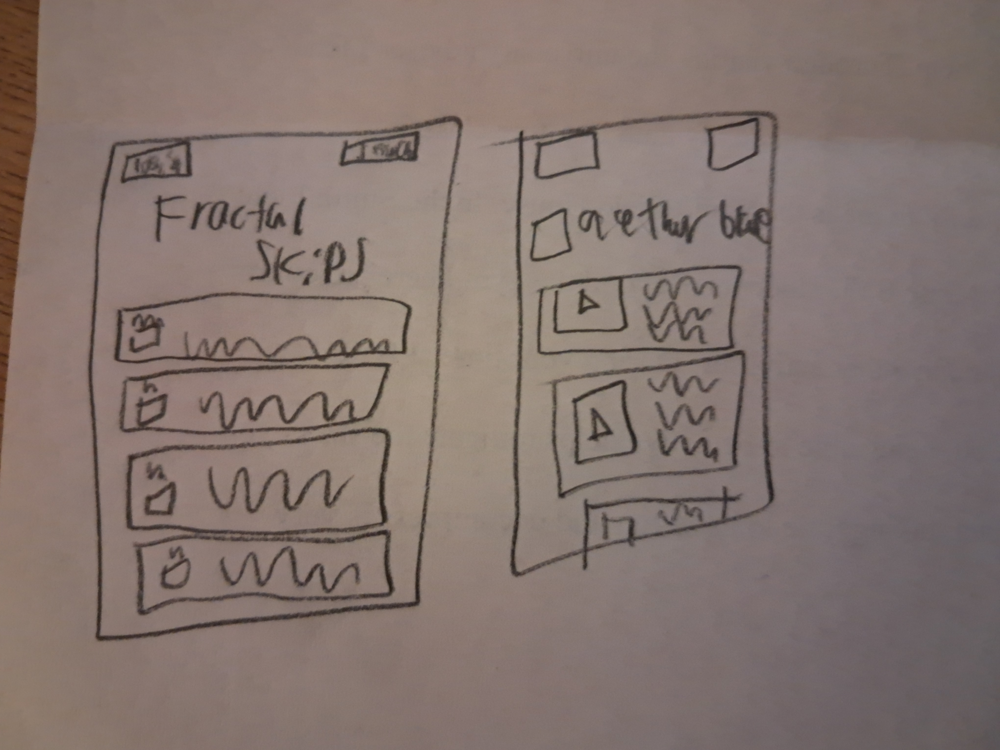

In the newest version, I've added a basic mostly placeholder website.

# GW2 fractal and sigil help

[My Notes](notes.md)

A website for Guild Wars 2 that shows common skips for fractals

### Elevator pitch

I am making a website that will show crowd-sourced skips for fractals to improve the everyday experience and speed of gameplay

### Design

### Key features

- Shows skips for fractals
- Logging in for crowd sourcing
- Updates for new fractals

### Technologies

I am going to use the required technologies in the following ways.

- **HTML** - Uses structural HTML to build the application. Includes an authentication page, a main dashboard for browsing skips, a submission form, and a live practice board.
- **CSS** - Styles the application for responsive design across different screen sizes. Implements a dark theme with consistent whitespace and color contrast to match the game's aesthetic.
- **React** - Handles the frontend UI components, including the dynamic submission form, the interactive skip gallery, state management for user sessions, and view routing.
- **Service** - An Express backend providing RESTful API endpoints to handle user authentication, fetch skip data, process new submissions, and pull current Daily Fractals from the official Guild Wars 2 API.
- **DB/Login** - Securely stores user credentials, skip details, and community votes in a database. Ensures only authenticated users can submit new content or vote.
- **WebSocket** - Broadcasts real-time updates across the platform so that new skip submissions and posts to the live practice LFG board appear instantly for all connected users without refreshing the page.

## 🚀 Specification Deliverable

> [!NOTE]
> Fill in this sections as the submission artifact for this deliverable. You can refer to this [example](https://github.com/webprogramming260/startup-example/blob/main/README.md) for inspiration.

For this deliverable I did the following. I checked the box `[x]` and added a description for things I completed.

- [x] I completed the prerequisites for this deliverable (Git commit requirement)
- [x] Proper use of Markdown
- [x] A concise and compelling elevator pitch
- [x] Description of key features
- [x] Description of how you will use each technology including your 3rd party API and use of WebSocket
- [x] One or more rough sketches of your application. Images must be embedded in this file using Markdown image references.

## 🚀 AWS deliverable

For this deliverable I did the following. I checked the box `[x]` and added a description for things I completed.

- [x] **Rented EC2 server** - I rented an EC2 Micro
- [x] **Leased domain name** - My domain name is jacobwittig.com
- [x] **Server accessible** from my domain: [https://jacobwittig.com](https://jacobwittig.com) - I did not complete this part of the deliverable.

## 🚀 HTML deliverable

For this deliverable I did the following. I checked the box `[x]` and added a description for things I completed.

- [x] I completed the prerequisites for this deliverable (Simon deployed, GitHub link, Git commits)
- [x] **HTML pages** - Created `index.html` (home + login), `fractals.html` (skips, submit form, live updates), and `gear.html` (gear lookup + API).
- [x] **Proper HTML element usage** - Used `header`, `nav`, `main`, `footer`, forms, tables, labels, and lists consistently across pages.
- [x] **Links** - Shared navigation between all pages, plus in-content links from home to Fractal Skips and Gear.
- [x] **Text** - Application copy describing fractal skips, gear recommendations, and how login, database, API, and WebSocket features will work.
- [x] **3rd party API placeholder** - Gear page includes a Guild Wars 2 API section with `https://api.guildwars2.com` and labeled response placeholders.
- [x] **Images** - Hero images on each page (`welcome.png`, `fractals.png`, `gear.png`), plus `gear-icon.png` and `favicon.svg`.
- [x] **Login placeholder** - Login/create form on home, with username display placeholder in the header on every page.
- [x] **DB data placeholder** - Placeholder tables for stored skips on Fractals and recommended gear on Gear, with clearly labeled example rows.
- [x] **WebSocket placeholder** - Live updates section on Fractals showing where realtime skip submissions and votes will appear.

## 🚀 CSS deliverable

For this deliverable I properly styled the application into its final appearance. Shared styles live in `styles.css` and are used by `index.html`, `fractals.html`, and `gear.html`.

- [x] I completed the prerequisites for this deliverable (Simon deployed at [simon.cs260.click](https://simon.cs260.click), GitHub link in the site footer, Git commits for this work)
- [x] **Visually appealing colors and layout. No overflowing elements.** - Dark Fractal Mists theme with navy backgrounds, crystal teal accents, and sparse gold highlights defined as CSS variables in `styles.css`. Open spacing, constrained image/table widths, and consistent panels so nothing overflows on desktop or mobile.
- [x] **Use of a CSS framework** - Bootstrap 5 (CDN) for the navbar, collapse menu, cards, forms, tables, buttons, and login modal. Custom theme overrides in `styles.css` keep the Bootstrap components matching the mists look.
- [x] **All visual elements styled using CSS** - Header/brand, navigation, hero images, feature cards, forms, tables, live-update list, gear API panel, login modal, and footer are all styled through Bootstrap classes plus `styles.css` (no unstyled default browser look).
- [x] **Responsive to window resizing using flexbox and/or grid display** - `body` is a flex column so the footer stays at the bottom. Navbar brand, user chip, and footer use flexbox. Home feature cards and the gear `.api-item` panel use CSS grid. Bootstrap `navbar-expand-lg` collapses the nav on small screens; hero images scale with `max-width: 100%`.
- [x] **Use of a imported font** - Google Fonts: Cormorant Garamond for headings/brand and Outfit for body text, linked in every HTML page head.
- [x] **Use of different types of selectors including element, class, ID, and pseudo selectors** - Element selectors for `body`, headings, links, and tables; class selectors for layout (`.site-header`, `.feature-card`, `.api-picture-box`, `.api-item`, `.btn-mist`, etc.); the ID selector `#login-title` for the unique sign-in dialog heading; pseudo selectors `:hover`, `:focus-visible`, `:disabled`, and `::placeholder` for interactive states.

## 🚀 React part 1: Routing deliverable

For this deliverable I did the following. I checked the box `[x]` and added a description for things I completed.

- [X] I completed the prerequisites for this deliverable (Simon deployed, GitHub link, Git commits)
- [x] **Bundled using Vite** - The site is a Vite single-page app. `npm run dev` serves it, and `npm run build` writes the production bundle to `dist`. Deployment uses `deployReact.sh`.
- [x] **Components** - Shared header, sign-in dialog, and footer live in `src/app.jsx`. Page content is in `src/home/home.jsx`, `src/fractals/fractals.jsx`, and `src/gear/gear.jsx`. Sign in and the login buttons use React Bootstrap.
- [x] **Router** - React Router swaps Home (`/`), Fractal Skips (`/fractals`), and Gear (`/gear`) without a full page load. Unknown paths show a not-found view.

## 🚀 React part 2: Reactivity deliverable

For this deliverable I did the following. I checked the box `[x]` and added a description for things I completed.

- [ ] I completed the prerequisites for this deliverable (Simon deployed, GitHub link, Git commits)
- [ ] **All functionality implemented or mocked out** - I did not complete this part of the deliverable.
- [ ] **Hooks** - I did not complete this part of the deliverable.

## 🚀 Service deliverable

For this deliverable I did the following. I checked the box `[x]` and added a description for things I completed.

- [ ] I completed the prerequisites for this deliverable (Simon deployed, GitHub link, Git commits)
- [ ] **Node.js/Express HTTP service** - I did not complete this part of the deliverable.
- [ ] **Static middleware for frontend** - I did not complete this part of the deliverable.
- [ ] **Calls to third party endpoints** - I did not complete this part of the deliverable.
- [ ] **Backend service endpoints** - I did not complete this part of the deliverable.
- [ ] **Frontend calls service endpoints** - I did not complete this part of the deliverable.
- [ ] **Supports registration, login, logout, and restricted endpoint** - I did not complete this part of the deliverable.
- [ ] **Uses BCrypt to hash passwords** - I did not complete this part of the deliverable.

## 🚀 DB deliverable

For this deliverable I did the following. I checked the box `[x]` and added a description for things I completed.

- [ ] I completed the prerequisites for this deliverable (Simon deployed, GitHub link, Git commits)
- [ ] **Stores data in MongoDB** - I did not complete this part of the deliverable.
- [ ] **Stores credentials in MongoDB** - I did not complete this part of the deliverable.

## 🚀 WebSocket deliverable

For this deliverable I did the following. I checked the box `[x]` and added a description for things I completed.

- [ ] I completed the prerequisites for this deliverable (Simon deployed, GitHub link, Git commits)
- [ ] **Backend listens for WebSocket connection** - I did not complete this part of the deliverable.
- [ ] **Frontend makes WebSocket connection** - I did not complete this part of the deliverable.
- [ ] **Data sent over WebSocket connection** - I did not complete this part of the deliverable.
- [ ] **WebSocket data displayed** - I did not complete this part of the deliverable.
- [ ] **Application is fully functional** - I did not complete this part of the deliverable.
